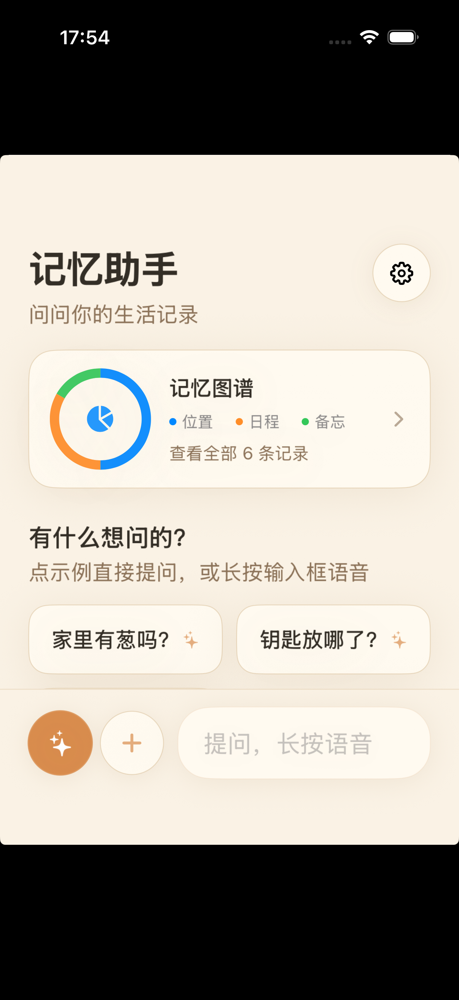
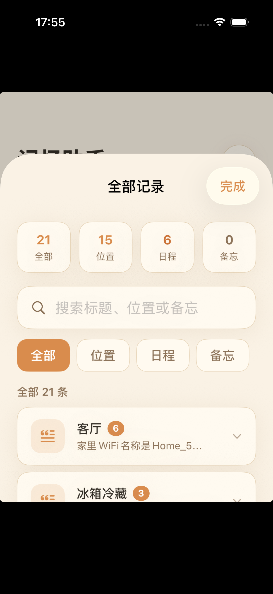
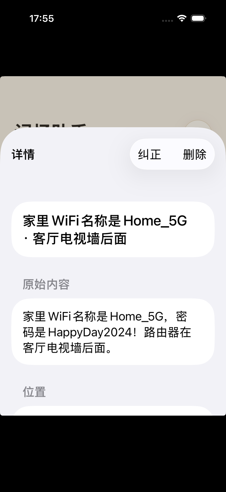
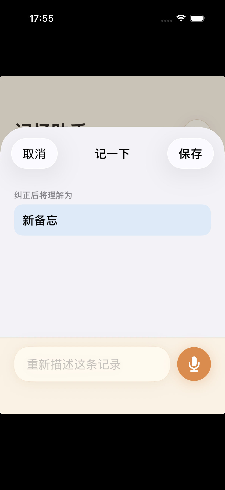
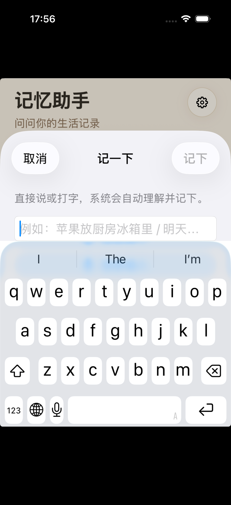
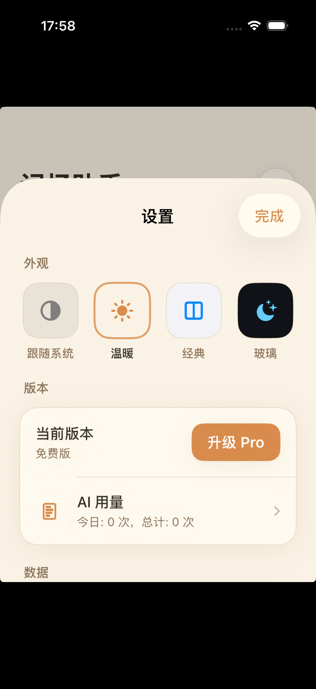
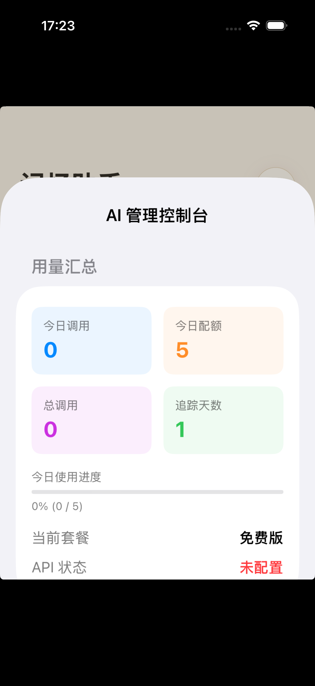
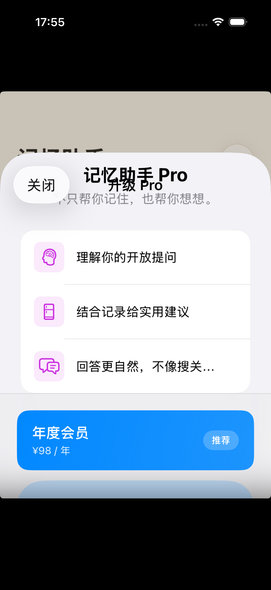
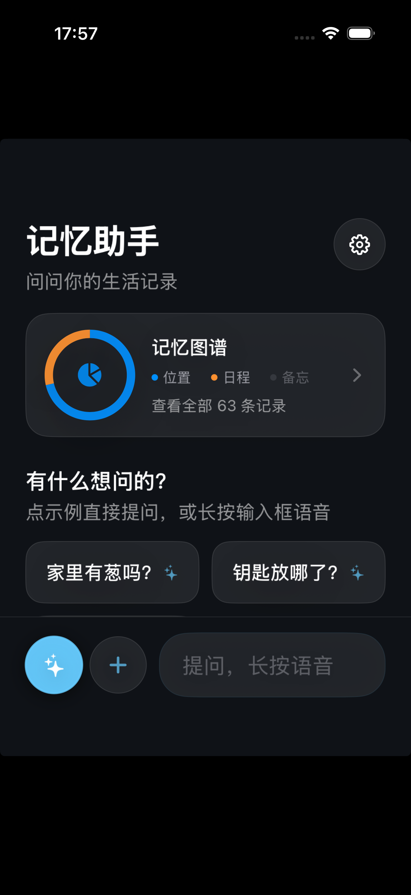
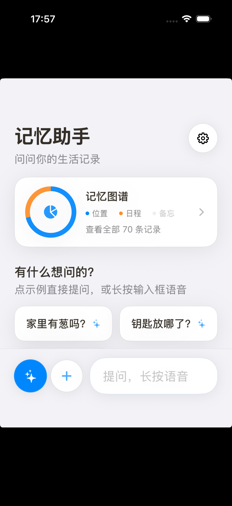

# 记忆助手 MemoryAssistant

> 📱 一款 iPhone 上的本地优先"记忆助手"——帮你记录和快速检索生活中的点滴，东西放在哪、日程安排、备忘笔记，都能一句话查到。


## ✨ 功能亮点

| 功能 | 说明 |
|---|---|
| 🧠 AI 智能问答 | 用自然语言提问，AI 从你的记忆库中找到答案 |
| 📍 位置记忆 | 记录物品放在哪，再也不用到处找东西 |
| 📅 日程提醒 | 快速记下会议、约会、待办事项 |
| 📝 通用备忘 | 灵感、想法、账号信息，随手就记 |
| 🎙️ 语音输入 | 长按说话，自动识别并智能分类保存 |
| 🗣️ Siri 集成 | 不用打开 App，直接对 Siri 说"钥匙放哪了" |
| 🎨 多主题 | 暖色 / 经典 / 玻璃 / 跟随系统，四种外观任你选 |
| 🔒 隐私安全 | 所有数据保存在 iPhone 本地，不上传服务器 |

## 📱 界面预览

<div align="center">

| 🧠 AI 智能问答 | 📝 全部记录 | 🔍 记录详情 |
|:---:|:---:|:---:|
|  |  |  |
| 首页对话界面 | 记录列表 | 记录详情 |

| ➕ 新增记录 | 🎙️ 语音录入 | ⚙️ 设置中心 |
|:---:|:---:|:---:|
|  |  |  |
| 三类记忆快速录入 | 长按说话自动识别 | 主题与数据管理 |

| 🤖 AI 管理控制台 | 💎 Pro 会员 |
|:---:|:---:|
|  |  |
| 用量统计与日志 | 解锁更多额度 |

</div>

### 🎨 多主题支持

<div align="center">

| 🌞 暖色主题 | 🌙 玻璃主题（暗色） | 📱 经典主题（系统） |
|:---:|:---:|:---:|
| （默认配色） |  |  |
| 温暖柔和 | 深邃玻璃质感 | 清爽系统风格 |

</div>

> 支持跟随系统自动切换，在设置中随时更换。

## 🏗️ 技术实现

- **平台**: iPhone / iOS
- **语言**: Swift 5.9
- **UI 框架**: SwiftUI
- **本地存储**: JSON 文件（应用沙盒）
- **AI 能力**: DeepSeek / 通义千问
- **语音识别**: Speech 框架
- **Siri 集成**: App Intents
- **应用内购**: StoreKit 2
- **三套主题**: 暖色 / 经典 / 玻璃 + 系统跟随

## 📁 项目结构

```
MemoryAssistant/
├── App/                    # App 入口与全局依赖
├── Models/                 # 数据模型（记录、主题、AI 服务等）
├── Services/               # 核心服务
│   ├── MemoryStore.swift   # 数据存储与搜索
│   ├── LLMService.swift    # AI 大模型服务
│   ├── LLMUsageTracker.swift  # AI 用量追踪
│   ├── LLMRequestLogger.swift # AI 请求日志
│   └── MemoryProStore.swift   # 会员与内购
├── ViewModels/             # 视图模型
├── Views/                  # SwiftUI 页面
│   ├── MemoryListView.swift   # 主页面
│   ├── SettingsView.swift     # 设置页
│   ├── AllRecordsView.swift   # 全部记录
│   ├── AdminConsoleView.swift # AI 管理控制台
│   └── Components/            # 通用组件
└── Intents/                # Siri / App Intents 集成
```

## 🚀 在 Mac 上运行

### 环境要求

- macOS 14+
- Xcode 15+
- [XcodeGen](https://github.com/yonaskolb/XcodeGen)（推荐）

### 生成工程

```bash
brew install xcodegen
cd MemoryAssistant/workspace
xcodegen generate
open MemoryAssistant.xcodeproj
```

然后在 Xcode 中：

1. 选择 iPhone 模拟器或真机
2. 按 `⌘R` 运行 App

### AI 功能配置（可选）

App 内置了 AI 问答能力，需要配置 API Key 才能使用：

1. 在 `MemoryAssistant/Services/LLMSecrets.swift` 中填入你的 API Key
2. 或在 App 内通过管理控制台配置

## 🤖 AI 使用说明

App 内置 AI 问答能力，需要配置 API Key 才能使用：

1. 支持 DeepSeek / 通义千问模型
2. 免费版每日 5 次 AI 调用
3. 升级 Pro 可享受每日 200 次调用
4. 所有提问仅发送记录摘要，保护隐私

> AI 用量可在「设置 → AI 用量」中查看

## 🧪 测试场景建议

### 基础功能
1. **手动新增记录** — 新建位置/日程/备忘各一条
2. **搜索记录** — 用关键词搜索，验证结果排序
3. **编辑与删除** — 修改记录内容、删除记录

### 语音与 Siri
1. **App 内语音录入** — 点击录音按钮，说"帮我记一下护照放在书房第二层抽屉"
2. **Siri 新增** — 对 Siri 说"用记忆助手记录 钥匙放在玄关柜左边"
3. **Siri 查询** — 对 Siri 说"用记忆助手找 钥匙在哪里"
4. **明天安排** — 录入明天日程后，对 Siri 说"查看记忆助手的明天安排"

### AI 功能
1. **自然语言提问** — 问"我钥匙放哪了"
2. **多轮对话** — 连续追问相关问题
3. **用量统计** — 在管理控制台查看调用记录

## 🔮 后续规划

- ☁️ iCloud 同步 — 多设备数据同步
- 🔍 更精准的语义搜索
- 📸 拍照录入 — 拍照自动识别并记录
- 🌙 更多主题 — 持续优化视觉体验

## 📄 License

MIT
